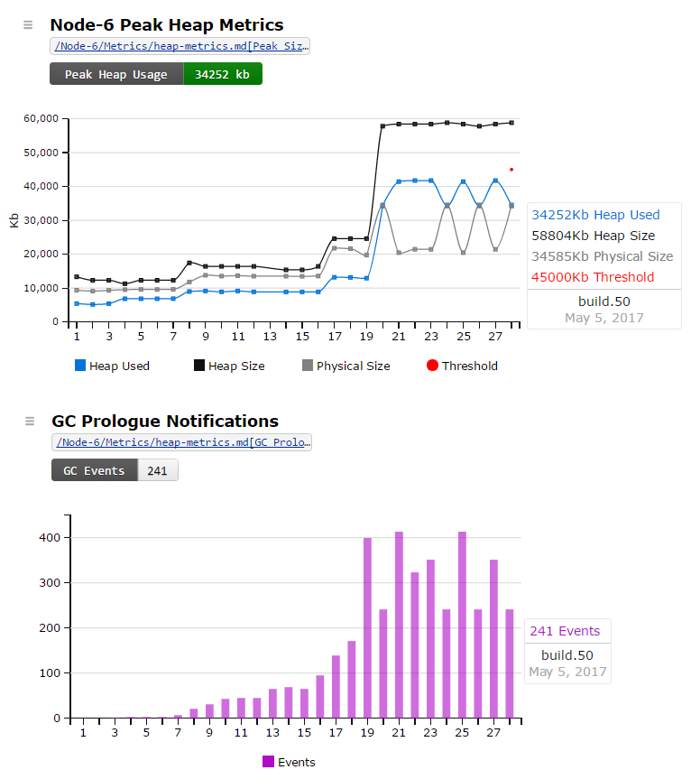
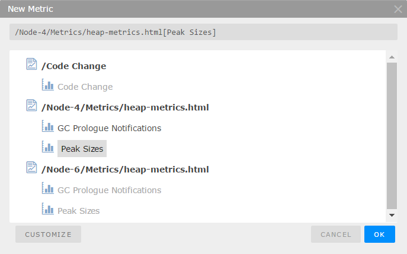
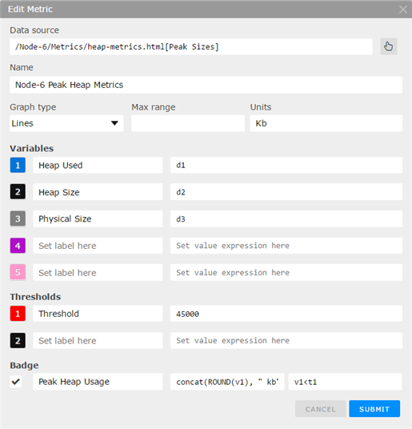
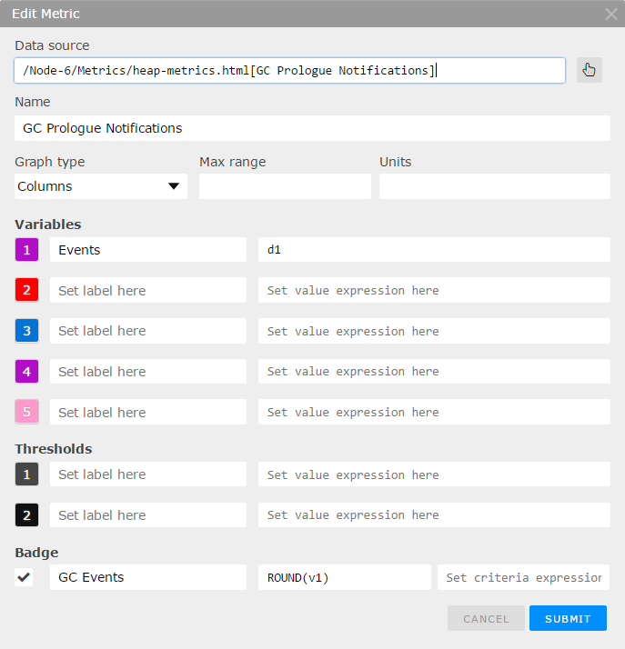

# Node Heap Metrics

[](https://travis-ci.org/rjhowell44/node-heap-metrics)
[](https://rjhowell44.testspace.com/spaces/1381 "Test Cases")
[](https://rjhowell44.testspace.com/spaces/1381/schema/Node-6/Metrics/heap-metrics.html "Node-6 Peak Heap Metrics")
[](https://rjhowell44.testspace.com/spaces/1381/schema/Node-6/Metrics/heap-metrics.html "Node-6 GC Events")
[](https://badge.fury.io/js/heap-metrics)
---
## Installation

```
- npm install heap-metrics

```

---
### Usage


```javascript
// require statement will enable V8 Heap Profiling
var heapMetrics = require( 'heap_metrics.node' );

//  ---- run some tests ----

// optionally, force final GC before dump (requires --expose_gc)
heapMetrics.ForceGC();

// get metrics and log to console
console.log(heapMetrics.GetHeapMetrics);

// dump metrics to file
heapMetrics.DumpHeapMetrics();
```

---
### Description
Enable and dump `Heap Profiler Metrics` to monitor the effects of code changes on heap usage for the life of each branch. 

Node Heap Metrics is written in C++, wrapped as a Node. The implementation makes use of the V8 Heap Profiler included with Node Js.  ([Official V8 Documentation](https://v8docs.nodesource.com/))

Heap metrics, maintained by the node, are update on V8's garbage collection (GC) Prologue Notifications -- in other words, just before GC -- ensuring peak measurements for the following metrics:
 * Heap Used
 * Heap Size
 * Physical Size

The class is implemented as a singleton. The first script to `require( 'heap_metrics.node' )` will intantiate the  object and **start heap profiling**. All subsequent calls to require() will return the singleton object while profilling is ongoing. 

---
### API Description

calling `heapMetrics.GetHeapMetrics()` will return the following object

```javascript
{ 'Heap Size Limit': '1,499,136 KB',
  'GC Prologue Notifications': 360,
  'Heap Used Metrics': 
   { 'At Ctor': '5,460 KB',
     'At Peak': '21,907 KB',
     'At last': '16,791 KB' },
  'Heap Size Metrics': 
   { 'At Ctor': '15,297 KB',
     'At Peak': '39,483 KB',
     'At last': '39,483 KB' },
  'Physical Size Metrics': 
   { 'At Ctor': '10,391 KB',
     'At Peak': '36,259 KB',
     'At last': '36,259 KB' } }
```     

Calling `heapMetrics.DumpHeapMetrics()` will produce 2 files: 1) **heap_metrics.html** 2) **heap_metrics.csv** -- both in `$(HOME)/bin` which must exist prior to calling (as of the current, initial release of 1.0.0) - the contents of each are shown below 


**Optionally** - you can then push the metric files -- along with the test results, code coverage, and other metrics -- to [Testspace](https://www.testspace.com/) in your CI .yml file (Travis, Circle CI, AppYayor, etc) 
(requires a free Testspace account)

```
  - testspace test*.xml coverage.xml heap_metrics.html{heap_metrics.csv}
  
```

---
### Testspace Metric Trends
The following timeline charts were produced by pushing changes (over 28 commits) made to the test script `Test/dump_heap_metrics.js` to this repository.  The test script consumes heap memory which can be increased or decreased by changing the exit/limit in a simple for-loop. The loop is then nested in a secondary loop. GC will be schedule each time the inner loop exists to free up all heap memory acquired in the inner scope. Increasing the limit on the outer loop will increase the number of GC events, but will also put more demand on heap usage, as the GC scheduler will fall behind. The  `metric files` are pushed from the `.travis.yml` file in this repository.*



More important than the actual heap numbers are the trends over successive commits, as they hightight any unexpected increases in heap usage.  Unexplained jumps are often caused by unintended side effects from code commits.  Unexplained increases can even be a sign of newly introduced memory leaks.  

The charts above (unintentionally) show an interesting price point on heap usage (on a Travis server).  When the `peek used size` reach the `peak physical size`, the physical size decreases dramatically, with the number of GC events nearly doubling. 

---
### Testspace Metric Setup
**Note:** *This is a onetime setup for a parent branch only. After using `git branch`, pushing test results and the above metric files from your CI -- running the new branch for the first time -- will create a new Space with all metric charts and settings from the parent branch automatically*

To setup the metrics shown above, once you've pushed the first set of metric files -- `heap_metrics.html` and `heap_metrics.cvs` -- to your Testspace Project:

  1. from the Space that's connected to your repository, select the Metrics tab
  2. from the Metrics tab, select the `New Metric` button top right.
  3. from the New Metrics dialog, select the metric to create (from the heap_metrics.csv file)
  4. select the `customize` button - see settings below for the two charts pictured above.
 
<br>


<br>


<br>


